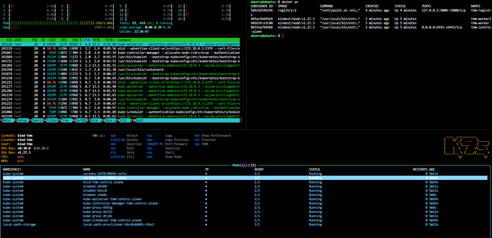
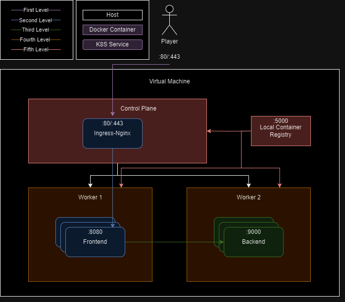

# TryHackMe Kubernetes CTF Room Builder

This project is meant to reliably build, test, and deploy a Kubernetes CTF room for TryHackMe.

## Description

In 2023 I participated in the TryHackMe Advent of Code Side Quest challenge. I was inspired to take some ideas and concepts there-in and build a way to scalably produce Kubernetes equivalent content to deploy to their platform. What follows is an attempt to do just that.

## Getting Started

```bash
ssh -l ubuntu <ip> # First time is required to set host fingerprints properly
python3 -m venv .venv
. .venv/bin/activate
pip install ansible
ansible-playbook -i inventory -K -k -u ubuntu base/ansible/k8scluster.yml
#Do things to the host
ansible-playbook -i inventory -K -k -u ubuntu sample-room/ansible/sample-room.yml
#Test room for intended paths
ansible-playbook -i inventory -K -k -u ubuntu base/ansible/pre-deploy.yml
```

The 50,000 ft view, low system usage and full capabilities of a K8s cluster.



An example layout of where this project aims to enable a room maker to inject vulnerabilities to be found. This can be made to be very very deep, or very shallow depending on needs. The default outset assumes the VM will largely be off-limits to the user, and they will be sandboxed into the cluster containers while having network access to any internal services.



### Dependencies

- Python
- kubectl
- Fresh install of Ubuntu 20.04

## Functional Flow

### Base

This folder is responsible for all base components to be deployed into a Ubuntu VM. It sets up QoL, Docker, KubernetesInDocker, ingress-nginx, and a local registry to enable the platform to be airgapped. This can be modified to include additional vulnerabilities by customizing the KinD node images or by adding additional components to the base playbook.

This also includes pre-deploy scripts to clean the system before deploying to THM, a final step to optimize the system, clean dangling log files, and mount user activity to /dev/null.

### Sample Room

This room is a basic conceptual room that is not deployed to THM. It is just a proof of concept to show how a room can be built and deployed to THM. It is not meant to be a real room, but rather an example with which to test this project.
