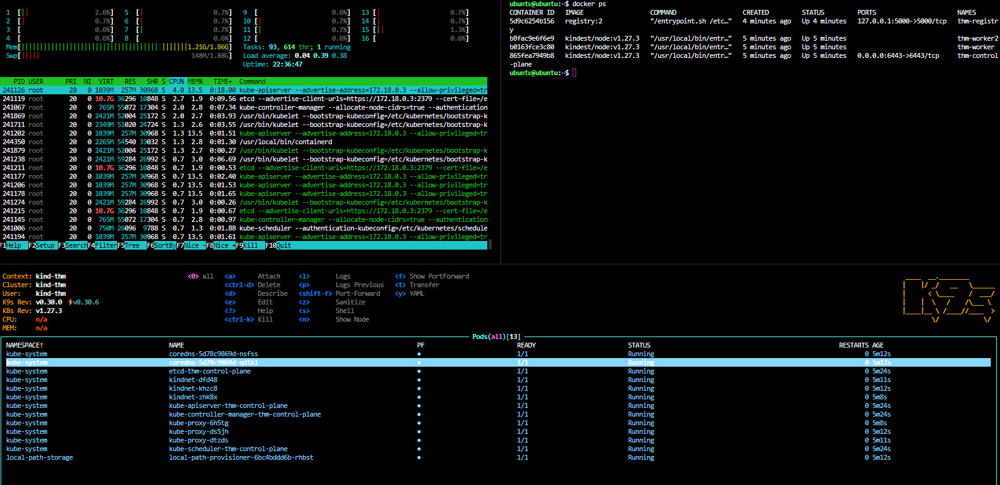

# TryHackMe Kubernetes CTF Room Builder

This project is meant to reliably build, test, and deploy a Kubernetes CTF room for TryHackMe.

## Description

An ansibilized generator to deploy a Kubernetes CTF room into a Ubuntu 20.04 VM

## Getting Started

```bash
python3 -m venv .venv
. .venv/bin/activate
pip install ansible
ansible-playbook -i ../inventory -K -k -u ubuntu k8scluster.yml
#Do things to the host
#Test room for intended paths
ansible-playbook -i ../inventory -K -k -u ubuntu pre-deploy.yml
```



### Dependencies

- Python
- kubectl
