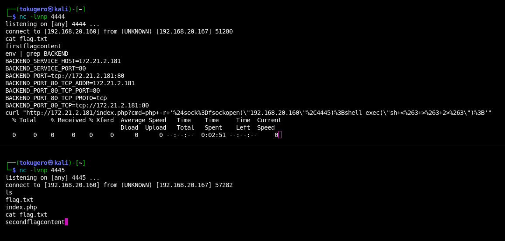

# Sample Room

A PoC of this platform. This will not be deployed to THM.

## Flag Locations

One flag in the frontend service /var/www/html directory.

## Special Tools/Techniques

There's a literal shell built into the front page with the only flag in that directory, please don't fail.

## Author's Notes

This is a placeholder document for the room. It will be updated as the room is built out.

# How To:

1. Browse to page
1. Setup listener
1. Submit reverse shell command
1. Use shell to find flag in landing path
1. Lookup other pod environments from namespace
1. Configure second listener
1. Curl second reverse shell command
1. Use shell to find flag in landing path

